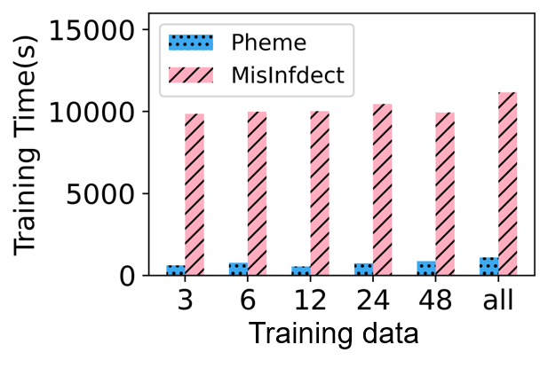
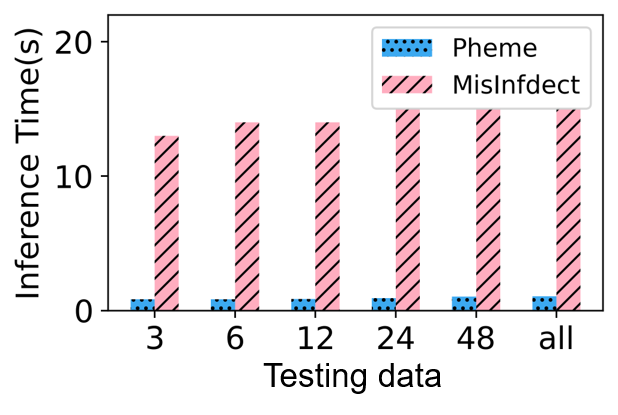

We divide the dataset into training, validation, and testing, 80% of the dataset is the training dataset, 10% is used as the validation dataset, 10% is used as the testing dataset. Considering the multi-stages awareness includes graph entropy calculation and stage division, we get the running time of these two parts are 25.11s and 7.26s, respectively. For the dynamic analysis module, we analyze the training time and the inference time of the model over two datasets. As shown in Fig. 9, the larger-scale MisInfdect dataset spend more time than the Pheme dataset both on training data and testing data. We note that the training time is shorter value on the Pheme dataset within 12 hours and on the MisInfdect dataset within 48 hours. Most likely the propagation structure within that time is easy to distinguish the truth and disinformation. Thus MsDD only takes a shorter time to train. In addition, the inference time increases a little with the increased data. A rational explain is the dataset has a few increase from 3 hours to 48 hours. Overall, our model maintains a rational range of training and inference time.

